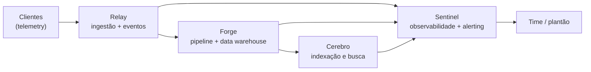

# Playbook de IA Operacional — Checkpoints (DevOps Pro)

**Fonte:** [Plataforma DevOps Pro](https://plataforma.devopspro.com.br/courses/8aef63f6-2e58-48da-b33e-e76c4b87f33b/20/9/56/conteudos?projeto=8&fase=37)  
**Curso:** Pós AIOps e IA na Engenharia de Cloud → Desafios Técnicos - IAOps  
**Coletado em:** 17/09/2026

---

# Operação contínua na Aegis

Deixa eu te apresentar o palco deste desafio. A Aegis é uma empresa de observabilidade e possuem o seu produto, um SaaS de observabilidade e resposta a incidentes: outras empresas plugam seus ambientes nela e passam a enxergar métricas, logs e alertas num lugar só. São quatro sistemas sustentando essa operação. O Relay é o barramento de eventos assíncrono e a borda de ingestão: todo o telemetry dos clientes entra por ele e é distribuído para o resto da plataforma. O Forge é o pipeline de dados e o data warehouse, onde o telemetry vira série temporal e tabela consultável. Em cima disso roda o Sentinel, o produto core de observabilidade e alerting que o cliente de fato usa. E o Cerebro é o sistema de indexação e busca, aquele que acha a agulha no palheiro de logs.

Em alto nível, o telemetry flui assim pela plataforma — vale ter esse desenho na cabeça:



O time que toca isso é enxuto, e você vai esbarrar com essas pessoas ao longo dos checkpoints. Tony Stark é o CTO e responde pela direção técnica. Pepper Potts, a CEO, lê tudo pela ótica de custo e crescimento. Carol Danvers é a Head of Product, que prioriza o que entra no roadmap. Steve Rogers é o staff engineer veterano que escreveu boa parte da plataforma antiga, e muita coisa ainda roda como ele deixou. Natasha Romanoff fecha a ponta de segurança e compliance, é dela o carimbo nos padrões internos. Bruce Banner lidera engenharia de dados e os modelos que rodam sobre o Forge. Sam Wilson lidera a SRE e o plantão. E Nick Fury é o diretor de operações da plataforma, que cobra previsibilidade de ponta a ponta.

A Aegis decidiu que o uso de IA pelo time de engenharia não pode mais ser ad-hoc — cada um com seu prompt solto no histórico do chat. O Nick Fury quer um playbook de IA operacional: uma biblioteca de prompts versionada, testada e tratada como código, que qualquer engenheiro do time possa pegar e confiar. Esse é o trabalho que cai na sua mesa.

E tem duas regras de método que valem pro desafio inteiro, presta atenção nelas. **Primeira:** todo prompt do playbook é parametrizável — ele recebe os dados variáveis por parâmetro (o snapshot, o alerta, os artefatos, o provedor), pra ser reusável, e não um prompt que serve a um caso só. **Segunda:** a forma recomendada de criar esses prompts é via meta-prompting — você dirige a IA pra gerar e refinar o prompt, em vez de redigir tudo na mão. O meta-prompt em si não precisa ser entregue; o que entra na biblioteca é o prompt parametrizável final, com a sua curadoria. E só pra deixar o escopo claro: aqui você trabalha com o modelo recebendo os dados no próprio prompt (chat, playground ou API), com os exemplos colados na entrada — este desafio não usa agentes de codificação nem tools externas, isso vem no módulo de agentes.

Nos próximos dez checkpoints a biblioteca nasce, amadurece e termina como um repositório testado em pipeline. A complexidade cresce a cada passo: os primeiros são mais diretos, os últimos te cobram decisão e síntese, não execução. Uma coisa eu já assumo aqui — que você está fluente nos cinco frameworks de prompt engineering que viu comigo. Eles vão aparecer como ferramenta de trabalho, não como conteúdo pra exercitar de novo.

---

## Checkpoint 01 - O primeiro prompt do playbook

Todo playbook começa com um item, e o da Aegis vai nascer de uma dor concreta da SRE. O time do Sam Wilson precisa de uma triagem rápida e confiável da saúde dos pods no cluster onde o Sentinel está hospedado — algo que qualquer plantonista possa rodar e confiar no resultado.

Hoje isso é resolvido no improviso. Alguém joga na IA um pedido solto, mais ou menos assim:

```
cria um script pra mim que olha os pods do meu cluster kubernetes e me
fala quais estão com problema, tipo reiniciando muito ou sem subir
```

Funciona mais ou menos, mas é vago demais pra virar item de playbook. Em vez de um script descartável, o que você vai construir é um prompt parametrizável que recebe um snapshot do cluster e devolve uma triagem com a causa provável de cada pod problemático. O prompt parte do princípio de que o snapshot foi coletado por quem tem acesso ao cluster — ele recebe o dado pronto na entrada, não vai buscar nada (sem agente, sem tool: o snapshot é colado no prompt).

E pra chegar numa conclusão de verdade, o snapshot não é só a lista de pods: vem com os eventos (`kubectl describe`) e os logs das aplicações. Três exemplos completos do que o prompt recebe:

**Entrada 1 — pod reiniciando:**

```
$ kubectl get pods -n sentinel-prod
NAME                            READY   STATUS             RESTARTS       AGE
sentinel-api-7d9c8b6f4-2xk9p    1/1     Running            0              6d
sentinel-api-7d9c8b6f4-h4m2t    0/1     CrashLoopBackOff   14 (90s ago)   42m
sentinel-worker-5b8f9c8d-jq7rs  1/1     Running            0              6d
sentinel-scheduler-6c4d7f-nn8vx 1/1     Running            0              6d
$ kubectl describe pod sentinel-api-7d9c8b6f4-h4m2t -n sentinel-prod
    State:          Waiting
      Reason:       CrashLoopBackOff
    Last State:     Terminated
      Reason:       OOMKilled
      Exit Code:    137
    Limits:         memory: 512Mi
    Requests:       memory: 256Mi
Events:
  Type     Reason   Age                 From     Message
  ----     ------   ----                ----     -------
  Warning  BackOff  2m (x18 over 40m)   kubelet  Back-off restarting failed container api
$ kubectl logs sentinel-api-7d9c8b6f4-h4m2t -n sentinel-prod --previous
2026-05-13 10:14:02 [INFO]  [api] startup complete, version 2.9.1
2026-05-13 10:14:48 [INFO]  [cache] loading 6h alert cache (heap 410Mi/512Mi)
2026-05-13 10:15:10 [WARN]  [runtime] high GC pressure, heap 498Mi/512Mi
2026-05-13 10:15:12 [FATAL] [runtime] out of memory, shutting down process
```

**Entrada 2 — pods que não sobem:**

```
$ kubectl get pods -n sentinel-prod
NAME                            READY   STATUS             RESTARTS   AGE
sentinel-api-7d9c8b6f4-2xk9p    1/1     Running            0          6d
sentinel-api-7d9c8b6f4-zzp10    0/1     ImagePullBackOff   0          8m
sentinel-ingest-8f7a9c5b-4dkqm  0/1     Pending            0          8m
sentinel-scheduler-6c4d7f-nn8vx 1/1     Running            0          6d
$ kubectl describe pod sentinel-api-7d9c8b6f4-zzp10 -n sentinel-prod
    State:    Waiting
      Reason: ImagePullBackOff
    Image:    registry.aegis.io/sentinel-api:2.9.2
Events:
  Type     Reason   Age   From     Message
  ----     ------   ----  ----     -------
  Warning  Failed   7m    kubelet  Failed to pull image "registry.aegis.io/sentinel-api:2.9.2": manifest unknown
  Warning  Failed   7m    kubelet  Error: ErrImagePull
  Normal   BackOff  6m    kubelet  Back-off pulling image "registry.aegis.io/sentinel-api:2.9.2"
$ kubectl describe pod sentinel-ingest-8f7a9c5b-4dkqm -n sentinel-prod
    State:    Waiting
      Reason: Pending
    Requests: cpu: 2
Events:
  Type     Reason            Age   From               Message
  ----     ------            ----  ----               -------
  Warning  FailedScheduling  7m    default-scheduler  0/6 nodes are available: 6 Insufficient cpu
```

**Entrada 3 — tudo saudável:**

```
$ kubectl get pods -n sentinel-prod
NAME                            READY   STATUS    RESTARTS     AGE
sentinel-api-7d9c8b6f4-2xk9p    1/1     Running   0            6d
sentinel-api-7d9c8b6f4-h4m2t    1/1     Running   0            6d
sentinel-worker-5b8f9c8d-jq7rs  1/1     Running   1 (3d ago)   6d
sentinel-scheduler-6c4d7f-nn8vx 1/1     Running   0            6d
$ kubectl logs sentinel-api-7d9c8b6f4-2xk9p -n sentinel-prod --tail=3
2026-05-13 11:02:31 [INFO] [api] health check OK, 0 errors in the last 5min
2026-05-13 11:03:31 [INFO] [api] processed 4.2k alerts/min, p99 latency 120ms
2026-05-13 11:04:31 [INFO] [api] health check OK
```

A partir do snapshot recebido, o prompt precisa: apontar os pods em estado problemático; para cada um, chegar à causa provável cruzando o status com os eventos e os logs (não só repetir o STATUS); recomendar a próxima ação do plantão; devolver uma saída legível, e não um dump cru; e reconhecer quando não há nada problemático (o caso da Entrada 3). Como é o primeiro item da biblioteca, é aqui que a estrutura dela começa a tomar forma.

**Tarefa.** Escrever o prompt parametrizável de triagem de pods (use meta-prompting para criá-lo) e executá-lo contra os três exemplos de entrada acima.

**Entregue.** Prompt parametrizável, execução (modelo e output) nos exemplos e curadoria.

---

## Checkpoint 02 - Padronizando as notas de triagem

Toda vez que o Sentinel dispara um alerta, o plantonista abre uma nota de triagem. O problema é que hoje cada um escreve do seu jeito, e isso atrapalha quem assume o turno seguinte. A Carol Danvers quer um padrão único de nota. Atenção a uma coisa neste checkpoint: ele tem duas listas diferentes de exemplos — o formato de saída (a nota pronta) e as entradas (os alertas crus). Não misture os dois.

**Formato de saída esperado** — é assim que a nota pronta deve ficar. O time consolidou três exemplos do padrão que considera bom; isto é referência de formato, não é entrada do prompt:

```
ALERTA: Relay - taxa de rejeição de ingestão acima de 2% por 5min
IMPACTO: ingestão de telemetry degradada para ~12% dos tenants
HIPÓTESE INICIAL: deploy do Relay às 09:14 reduziu o buffer de ingestão
AÇÃO IMEDIATA: rollback iniciado via Argo CD
ESCALAR PARA: @relay-core se a rejeição não cair em 10min

ALERTA: Forge - lag de ingestão acima de 15min
IMPACTO: dashboards do Sentinel atrasados para todos os tenants
HIPÓTESE INICIAL: pico de volume do tenant acme-corp saturou o consumer
AÇÃO IMEDIATA: aumento manual de partições do consumer do Relay
ESCALAR PARA: @data-platform se lag não estabilizar em 20min

ALERTA: Cerebro - latência de busca p99 acima de 4s
IMPACTO: investigação de incidentes lenta para o time interno
HIPÓTESE INICIAL: reindexação noturna não concluiu antes do horário comercial
AÇÃO IMEDIATA: pausar reindexação e priorizar shard quente
ESCALAR PARA: @search-infra se p99 não cair em 15min
```

**Entradas para usar no prompt** — agora sim, os alertas crus que o prompt recebe por parâmetro e transforma em nota. São estes três (e só estes) que você vai rodar para testar:

**Entrada 1:**

```
2026-05-12 14:02:09 UTC [Sentinel] autoscaler hit max replicas (60/60) on sentinel-api,
queue depth on Relay growing 2k/min, CPU avg 88%, tenant stark-industries
sending 4x baseline volume after onboarding new region
```

**Entrada 2:**

```
2026-05-13 03:11:00 UTC [Relay] ingest reject rate 6% for 8min, tenant wakanda-systems,
buffer saturated after deploy 02:55
```

**Entrada 3:**

```
2026-05-13 11:40:22 UTC [Forge] consumer lag 9min and climbing, batch forge-batch-ingest
delayed after previous job failure, downstream Sentinel starting to lag
```

Você vai construir um prompt parametrizável que produza a nota padronizada a partir de qualquer alerta cru. A decisão de método aqui é sua: dá pra ensinar esse padrão ao modelo de mais de uma forma, e é essa escolha que você vai justificar.

**Tarefa.** Escrever o prompt parametrizável de geração de notas de triagem (use meta-prompting para criá-lo) e executá-lo contra os três alertas crus acima.

**Entregue.** Prompt parametrizável, execução (modelo e output) nos exemplos e curadoria.

---

## Checkpoint 03 - Causa-raiz da degradação no Cerebro

Agora um caso mais detalhado. O Cerebro — o sistema de indexação e busca da Aegis — começou a devolver buscas lentas e, em alguns casos, resultados incompletos. O Sam Wilson, do plantão, levantou três artefatos antes de escalar pra você. Cada um vem de uma fonte diferente, e vale saber de onde, porque é cruzando os três que se chega à causa. (Você não precisa conhecer o Cerebro por dentro — os artefatos abaixo trazem tudo que importa.)

**Artefato 1** — a configuração do cluster Elasticsearch do Cerebro. O Cerebro é um serviço Java e usa o Elasticsearch como motor de indexação e busca (o Elasticsearch também roda na JVM — por isso o heap aparece em GB). Este é o arquivo cerebro.yaml, versionado no repositório de infra, que define os parâmetros do cluster — shards, réplicas, heap da JVM, job de reindexação e cache de query. Não é configuração de aplicação de negócio nem de banco relacional: são os ajustes do próprio Elasticsearch.

```yaml
# cerebro.yaml — configuração do cluster Elasticsearch (repositório de infra)
cerebro:
  shards: 12
  replicas_per_shard: 1
  jvm_heap: 8g
  refresh_interval: 1s
  reindex_job:
    schedule: "0 2 * * *"     # roda todo dia às 02:00
    avg_duration_min: 90      # normalmente termina ~03:30
  query_cache:
    enabled: true
    size_mb: 512
```

**Artefato 2** — as métricas do Cerebro nas últimas duas horas. Saíram do dashboard do Sentinel, que é o produto de observabilidade da própria Aegis e coleta as métricas de todos os sistemas. Cada linha é um ponto de 30 em 30 minutos:

```
timestamp              search_p99_ms   indexed_docs_per_s   heap_used_pct   cache_hit_pct
2026-05-13 08:00 UTC   850             4200                 61              74
2026-05-13 08:30 UTC   1100            4100                 68              71
2026-05-13 09:00 UTC   2300            9800                 79              58
2026-05-13 09:30 UTC   4100            11200                88              41
2026-05-13 10:00 UTC   6700            12400                94              29
```

O que cada coluna diz:

- **search_p99_ms** — latência da busca no percentil 99, em milissegundos: 99% das buscas terminam abaixo desse valor (quanto menor, melhor; 850ms já é alto, 6700ms é crítico).
- **indexed_docs_per_s** — documentos indexados por segundo, ou seja, a vazão de escrita no índice.
- **heap_used_pct** — percentual do heap da JVM em uso, sendo o teto o jvm_heap: 8g do Artefato 1.
- **cache_hit_pct** — percentual de buscas atendidas pelo query_cache sem reprocessar (quanto maior, menos esforço por query).

**Artefato 3** — um trecho dos logs de um nó do Cerebro, coletado com kubectl logs no pod cobrindo a janela do problema (~08h às ~10h, as mesmas 2h das métricas). É o log nativo do Elasticsearch (horário em UTC):

```
[2026-05-13T08:02:11,540][INFO ][o.e.t.LoggingTaskListener              ][cerebro-node-3] reindex task [88123] (scheduled 02:00) progress, created [3.8M]/[10M] docs (38%)
[2026-05-13T08:14:33,019][WARN ][o.e.m.j.JvmGcMonitorService            ][cerebro-node-3] [gc][young] duration [620ms], collections [1] in [10s], heap [4.9gb]->[3.1gb]/[8gb]
[2026-05-13T08:41:07,222][INFO ][o.e.i.IndexingMemoryController         ][cerebro-node-3] now throttling indexing for shard [logs-2026.05][7]: segment writing can't keep up
[2026-05-13T09:03:55,810][WARN ][o.e.t.ThreadPool                       ][cerebro-node-3] write thread pool queue at [150/200]
[2026-05-13T09:12:48,402][WARN ][o.e.m.j.JvmGcMonitorService            ][cerebro-node-3] [gc][old] duration [1.1s], collections [2] in [60s], heap [6.3gb]->[5.9gb]/[8gb]
[2026-05-13T09:20:02,118][INFO ][o.e.t.LoggingTaskListener              ][cerebro-node-3] reindex task [88123] (scheduled 02:00) progress, created [4.0M]/[10M] docs (40%)
[2026-05-13T09:31:17,653][WARN ][o.e.i.b.HierarchyCircuitBreakerService ][cerebro-node-3] [parent] usage [6.9gb/8gb] (86%), approaching limit
[2026-05-13T09:44:29,901][WARN ][o.e.s.SearchService                    ][cerebro-node-3] slow query on shard [logs-2026.05][7] took [2380ms]
[2026-05-13T09:51:08,377][WARN ][o.e.t.ThreadPool                       ][cerebro-node-3] write thread pool queue at [188/200]
[2026-05-13T09:58:41,102][WARN ][o.e.t.ThreadPool                       ][cerebro-node-3] write thread pool queue full [200/200], rejecting bulk — EsRejectedExecutionException
[2026-05-13T09:58:43,210][WARN ][o.e.m.j.JvmGcMonitorService            ][cerebro-node-3] [gc][old] duration [1.8s], collections [4] in [60s], heap [7.6gb]->[7.4gb]/[8gb]
[2026-05-13T09:58:44,005][INFO ][o.e.t.LoggingTaskListener              ][cerebro-node-3] reindex task [88123] (scheduled 02:00) still running, created [4.1M]/[10M] docs (41%), ETA unknown
[2026-05-13T09:58:45,889][WARN ][o.e.i.IndexingMemoryController         ][cerebro-node-3] indexing buffer above limit, throttling shard [logs-2026.05][7]
[2026-05-13T09:58:46,330][DEBUG][o.e.s.query.QueryPhase                 ][cerebro-node-3] shard [logs-2026.05][7] search took [5031ms] (timeout [5000ms])
[2026-05-13T09:58:46,512][ERROR][o.e.s.SearchService                    ][cerebro-node-3] search returned partial results: 11/12 shards succeeded
[2026-05-13T09:58:46,701][WARN ][o.e.i.b.HierarchyCircuitBreakerService ][cerebro-node-3] [parent] circuit breaker tripped, usage [7.7gb/8gb] (96%) over limit
[2026-05-13T09:58:47,001][WARN ][o.e.i.cache.query.IndicesQueryCache    ][cerebro-node-3] query cache eviction rate spiking, hit_ratio dropped to 0.29
[2026-05-13T10:01:12,778][ERROR][o.e.s.SearchService                    ][cerebro-node-3] CircuitBreakingException: [parent] Data too large, would be [7.9gb/8gb]
[2026-05-13T10:03:39,255][WARN ][o.e.t.ThreadPool                       ][cerebro-node-3] write thread pool rejected [1284] bulk requests in last 5min
[2026-05-13T10:05:50,640][ERROR][o.e.s.SearchService                    ][cerebro-node-3] all shards failed for index [logs-2026.05] on 3 of last 20 queries
```

Como ler: é o log nativo do Elasticsearch, e o trecho cobre as mesmas ~2h das métricas (08h→10h), então dá pra acompanhar a degradação se construindo. Cada linha traz o horário (UTC, ISO com milissegundos), o nível (INFO/WARN/ERROR/DEBUG), a classe Java que emitiu (o.e.… é abreviação de org.elasticsearch.…) e o nó (cerebro-node-3). O que importa aqui:

- **ThreadPool** — a fila de escrita encheu e os bulks de indexação estão sendo rejeitados (EsRejectedExecutionException).
- **JvmGcMonitorService** — garbage collector com pausas longas e o heap colado no teto de 8gb.
- **LoggingTaskListener** — o job de reindex agendado (02:00) ainda em 41% (4.1M de 10M docs).
- **IndexingMemoryController** — o buffer de indexação acima do limite, forçando throttle no shard 7.
- **QueryPhase / SearchService** — buscas estourando o timeout de 5s e retornando resultado parcial (11 de 12 shards).
- **HierarchyCircuitBreakerService** — o circuit breaker de memória disparou a 96% do heap, recusando novas operações.
- **IndicesQueryCache** — o cache de query com eviction alta e o hit ratio caído pra 0.29 (= os 29% da métrica).

A reindexação que deveria ter terminado às 03:30 ainda estava em 41% às 10:00. O prompt que você vai construir recebe esse pacote de artefatos (config, métricas e log) como parâmetro e precisa levar a IA a raciocinar até a causa-raiz, e não só listar sintoma — o tipo de prompt que o time vai reusar toda vez que uma degradação dessas aparecer, trocando só o pacote de entrada. Os dados são fictícios, mas trata eles como produção: decide o que precisaria ser tratado antes de mandar isso pra um modelo externo.

**Tarefa.** Escrever o prompt parametrizável de análise de causa-raiz (que recebe os artefatos como entrada; use meta-prompting para criá-lo) e executá-lo sobre os artefatos acima.

**Entregue.** Prompt parametrizável, execução (modelo e output) e curadoria.

---

## Checkpoint 04 - Segurando a sobrecarga do Relay

Lembra que o Relay é o barramento por onde todo o telemetry dos clientes passa antes de chegar no resto da plataforma. Quando um cliente grande dispara muito mais dado que o normal, o Relay recebe mais do que consegue entregar e a fila começa a acumular. Esse atraso vai empurrando o Sentinel junto, e o alerta que deveria sair na hora atrasa.

O Tony Stark quer uma estratégia para segurar esse excesso quando ele acontece — o nome técnico disso, em sistemas de fila, é **backpressure**. O problema é que não existe resposta única: dá pra resolver de várias formas, e cada uma tem um preço. Estes são os dados que o time juntou (o que se sabe do Relay hoje e as regras que a solução tem que respeitar):

```
Relay (barramento de eventos):
- throughput sustentado: 180k msgs/s
- pico observado no incidente da semana passada: 320k msgs/s por 25min
- retenção atual: 4h
- consumidores: Forge (ingestão), Sentinel (alerting em tempo real)

Restrições do time:
- alerting do Sentinel não pode atrasar mais que 60s (SLA com cliente)
- ingestão do Forge pode atrasar até 15min sem violar SLA
- orçamento de infra do trimestre já está 8% acima do previsto
- Steve Rogers lembra que o barramento antigo perdia mensagens sob pico,
  e perda de telemetry é inaceitável para um produto de observabilidade
```

Existe mais de um caminho defensável, e você não precisa decorar nenhum — alguns dos que estão em cima da mesa:

- dar prioridade ao Sentinel (alerting em tempo real) na frente do Forge (que pode esperar até 15min);
- guardar o que não foi processado numa fila separada para reprocessar depois (o que se chama dead-letter queue);
- dividir o Relay por cliente, para que um cliente barulhento não atrapalhe os outros;
- aumentar automaticamente o número de consumidores quando a carga sobe.

Pode ser um desses, pode ser uma combinação. O que você vai construir é um prompt parametrizável que recebe esse cenário (o estado + as restrições) e faz a IA comparar mais de um caminho, pesando prós e contras, antes de recomendar — em vez de cuspir uma resposta única. Como a decisão é cara, o raciocínio importa tanto quanto a recomendação.

**Tarefa.** Escrever o prompt parametrizável que apoia essa decisão (recebe o cenário como entrada; use meta-prompting para criá-lo) e executá-lo sobre o cenário do Relay.

**Entregue.** Prompt parametrizável, execução (modelo e output) e curadoria.

---

## Checkpoint 05 - Migrando o Forge de lote para tempo real

O Forge é o pipeline de dados da Aegis — é ele que pega o telemetry e transforma em tabela consultável. Hoje ele roda em lote (batch): de hora em hora um job acorda, lê tudo que acumulou e processa de uma vez. Foi assim que o Steve Rogers montou anos atrás. O Bruce Banner quer mudar pra um modelo orientado a eventos (event-driven): em vez de esperar fechar a hora, o Forge passa a consumir cada evento do Relay assim que ele chega e processar quase em tempo real.

Só que essa mudança é grande demais pra resolver num prompt só — se você jogar tudo de uma vez na IA, a resposta sai rasa e genérica. O estado atual do Forge:

```
Forge hoje:
- ingestão: um job em cron acorda a cada 60min (o "forge-batch-ingest")
- transformação: 14 etapas de processamento encadeadas (em Spark), ~40min no total
- destino: grava em tabelas no data warehouse, particionadas por hora
- ponto frágil: se um lote falha, o próximo acumula o dobro de volume
- quem depende do Forge: Sentinel (lê as tabelas agregadas), Cerebro (indexa
  os eventos transformados) e os relatórios de billing da Pepper (rodam de madrugada)
```

O que a migração precisa garantir:

- consumir do Relay continuamente, processando em pequenos blocos no lugar do lote de 1h
- manter quem depende do Forge funcionando durante a transição
- nada de virada única (big-bang): a migração tem que ir em passos e poder voltar atrás

O caminho aqui é quebrar a migração em etapas e resolver uma de cada vez com a IA, cada etapa usando o resultado da anterior — em vez de um único prompt gigante. Isso se chama **encadear prompts**: por exemplo, um prompt diagnostica o estado atual, o próximo propõe o passo a passo da migração, o seguinte detalha o plano executável e reversível. A entrega não é um prompt monolítico; é essa cadeia, com cada elo recebendo a saída do anterior como entrada.

**Tarefa.** Escrever a cadeia de prompts parametrizáveis da migração (use meta-prompting para criá-la) e executá-la sobre o cenário do Forge.

**Entregue.** Os prompts parametrizáveis da cadeia, execução (modelo e output de cada elo) e curadoria.

---

## Checkpoint 06 - Endurecendo a NetworkPolicy do Sentinel

A Natasha Romanoff barrou um manifesto de NetworkPolicy que ia subir pro namespace do Sentinel: estava permissivo demais, e um erro ali expõe o produto core. (Pra nivelar: uma NetworkPolicy é a regra de rede do Kubernetes — define quem pode falar com quem. Ingress é o que pode entrar nos pods, egress é pra onde eles podem sair, e default-deny significa bloquear tudo por padrão e liberar só o que for necessário.) Antes de virar item do playbook, esse tipo de artefato crítico precisa passar por verificação e refino — não pode sair na primeira tentativa. Este é o manifesto que ela barrou — repara que ele libera tudo:

```yaml
# manifesto barrado pela revisão de segurança — permissivo demais
apiVersion: networking.k8s.io/v1
kind: NetworkPolicy
metadata:
  name: sentinel-allow
  namespace: sentinel-prod
spec:
  podSelector: {}          # aplica a todos os pods do namespace
  policyTypes:
    - Ingress
    - Egress
  ingress:
    - {}                   # libera QUALQUER origem
  egress:
    - {}                   # libera QUALQUER destino
```

O problema salta aos olhos: o `podSelector: {}` pega todos os pods do namespace e as regras `- {}` liberam qualquer entrada e qualquer saída — é um allow-all disfarçado de política. A versão corrigida precisa seguir o padrão da Aegis:

```
NetworkPolicy para o namespace "sentinel-prod":
- pods do Sentinel só aceitam tráfego de entrada do Relay (consumo de
  eventos) e do gateway de API da plataforma
- pods do Sentinel só fazem saída para: Forge (warehouse, porta 5432),
  Cerebro (busca, porta 9200) e DNS interno
- nada de "allow all" em ingress ou egress
- política default-deny explícita no namespace
- toda regra precisa de comentário dizendo qual fluxo legítimo ela libera
```

Pra escrever os seletores certos — e não inventar labels —, o prompt também precisa saber como cada serviço é identificado no cluster:

```
Sentinel     → namespace sentinel-prod, pods com label app=sentinel
Relay        → namespace relay-prod,    pods com label app=relay
API gateway  → namespace edge,          pods com label app=api-gateway
Forge        → namespace forge-prod,    pods com label app=forge,   porta 5432 (Postgres do warehouse)
Cerebro      → namespace cerebro-prod,  pods com label app=cerebro, porta 9200 (Elasticsearch)
DNS interno  → namespace kube-system,   pods com label k8s-app=kube-dns, porta 53
```

Você vai construir um prompt parametrizável que recebe um manifesto permissivo como esse (mais as regras do padrão e o mapa de serviços acima) e devolve a versão corrigida e endurecida — e que, na sequência, passa por um processo de verificação e refino dirigido por você, onde a IA critica a própria saída, levanta as perguntas de verificação que um revisor de segurança faria, e melhora a versão a cada rodada. Registra as iterações: a v1, o que a verificação apontou, e como a v2 (e a v3, se rolar) endereçou cada ponto. Essas iterações são parte do valor da entrega.

**Tarefa.** Escrever o prompt parametrizável que recebe o manifesto permissivo acima e as regras e produz a NetworkPolicy corrigida (use meta-prompting para criá-lo), e conduzir a verificação e o refino.

**Entregue.** Prompt parametrizável, execução com as iterações (v1 → verificação → v2 → …) e curadoria.

---

## Checkpoint 07 - A biblioteca vira código

A essa altura você já tem um punhado de prompts parametrizáveis, cada um nascido sob a sua direção. Só que o Nick Fury não aceita isso espalhado: o playbook precisa virar um ativo versionado, tratado como código, que sobreviva à saída de qualquer pessoa do time. Esse checkpoint é sobre transformar a coleção numa biblioteca de verdade — e você não vai inventar a estrutura do zero.

Use como base o template prompt-registry: https://github.com/fabricioveronez/prompt-registry. Faça um fork (ou clone como ponto de partida) e organize os seus prompts seguindo as convenções dele. Em resumo, o template define:

- categorias como pastas na raiz, em kebab-case (`devops/`, `desenvolvimento/`, …), uma por domínio, sem aninhar — os prompts do playbook caem naturalmente em `devops/`;
- um prompt por pasta, nomeada pelo resultado e não pela técnica (ex.: `triagem-de-pods/`, não `chain-of-thought/`), com dois arquivos:
  - `prompt.md` — o frontmatter + o texto puro do prompt, com os parâmetros como placeholders `{{variavel}}`;
  - `README.md` — o mesmo frontmatter + a documentação humana (objetivo, casos de uso, exemplo, limitações);
- frontmatter com `nome`, `descricao`, `versao` (semver), `tags` e `inputs` — e repara que o `inputs` (lista de parâmetros, cada um com `nome` e `descricao`) é exatamente onde os parâmetros dos seus prompts ficam documentados;
- versionamento pelo campo `versao` de cada prompt + commits semânticos com o escopo na categoria (ex.: `feat(devops): adiciona prompt de triagem de pods`), mantendo os índices nos READMEs atualizados.

Migra para esse formato os prompts que você já produziu nos Checkpoints 01 a 06: cada um vira uma pasta com `prompt.md` parametrizado e `README.md` documentado (objetivo, casos de uso, exemplo e limitações). É aqui que o "todo prompt é parametrizável" encontra a estrutura — os `{{placeholders}}` do `prompt.md` e o `inputs` do frontmatter são a mesma coisa, agora versionada. Cada prompt nasce na `versao: 1.0.0`, e daqui pra frente toda mudança passa por commit semântico — o playbook deixa de ser texto solto e vira ativo do time.

**Tarefa.** Montar o repositório a partir do template prompt-registry e migrar os prompts dos Checkpoints 01 a 06 para o formato `prompt.md` + `README.md` com frontmatter, versionados e documentados.

**Entregue.** O link do repositório baseado no template, um prompt já no formato completo (o `prompt.md` com `{{placeholders}}` e o `README.md` com frontmatter) como exemplo dos demais, e uma nota curta sobre como você mapeou o playbook nas convenções do template.

---

## Checkpoint 08 - Testes determinísticos com promptfoo

Prompt na biblioteca sem teste é prompt em que ninguém confia. A partir daqui, cada prompt ganha o seu próprio `promptfooconfig.yaml`, ao lado do `prompt.md` na pasta do prompt — o teste viaja junto com o prompt. Neste checkpoint você escreve esses testes e roda de verdade (`promptfoo eval`).

Mas atenção: nem todo prompt dá pra testar de forma determinística (sem julgamento humano), só os de **saída estruturada**. Os de saída aberta — causa-raiz (CP03), decisão de backpressure (CP04) e migração (CP05) — não têm resposta única verificável por regex; eles pedem avaliação por julgamento, a camada que você monta no Checkpoint 09 e estende no 10. Aqui você cobre os três prompts de saída estruturada, e os requisitos de cada um já estão dados (nada de "o que você achar melhor"):

### 1. nota-de-triagem → `devops/nota-de-triagem/promptfooconfig.yaml`

Rodar contra os 3 alertas crus do Checkpoint 02. Em toda saída, os asserts devem garantir que:

- contém os cinco rótulos: `ALERTA:`, `IMPACTO:`, `HIPÓTESE INICIAL:`, `AÇÃO IMEDIATA:`, `ESCALAR PARA:`;
- o campo de escalonamento tem um handle no formato `@palavra` (regex `ESCALAR PARA:.*@\w+`);
- a nota é concisa: no máximo 8 linhas.

Esqueleto pra você completar (o `alerta_cru` é o parâmetro do prompt — é ele que varia entre os casos; complete com os 3 alertas do CP02):

```yaml
prompts:
  - file://devops/nota-de-triagem/prompt.md
providers:
  - openai:gpt-4o-mini
  # adicione um segundo provider de outro fornecedor
tests:
  - vars:
      alerta_cru: >
        2026-05-12 14:02:09 UTC [Sentinel] autoscaler hit max replicas (60/60)
        on sentinel-api, queue depth on Relay growing 2k/min, CPU avg 88%
    assert:
      # complete com os asserts da lista acima
```

### 2. triagem-de-pods → `devops/triagem-de-pods/promptfooconfig.yaml`

Rodar contra as 3 entradas (snapshots) do Checkpoint 01. Os asserts devem garantir que:

- na Entrada 1, a saída cita o pod `sentinel-api-7d9c8b6f4-h4m2t` e a causa (contém `OOMKilled` ou `memória`);
- na Entrada 2, cita os dois pods problemáticos e suas causas (a tag `2.9.2`/`ImagePullBackOff` e a falta de cpu/`Insufficient`);
- na Entrada 3 (saudável), a saída indica que não há pod problemático e não classifica nenhum pod como em falha.

### 3. networkpolicy-sentinel → `devops/networkpolicy-sentinel/promptfooconfig.yaml`

Rodar contra o manifesto permissivo + as regras + o mapa de serviços do Checkpoint 06. Os asserts devem garantir, na NetworkPolicy gerada, que:

- é YAML com `kind: NetworkPolicy` e `policyTypes` contendo `Ingress` e `Egress`;
- não há regra allow-all (a saída não contém `- {}`);
- o egress libera Forge (porta `5432`) e Cerebro (porta `9200`), e o ingress libera o Relay (`app: relay`);
- toda regra tem comentário (`#`).

Além dos requisitos específicos de cada prompt, **todo config inclui dois limites operacionais** — o playbook trata latência e custo como parte da qualidade:

- **latência:** cada chamada responde em no máximo 5s (`assert latency`);
- **custo:** cada chamada custa no máximo US$ 0,01 (`assert cost`).

Esses dois limites conversam direto com a sua escolha de modelo: um modelo mais caro ou mais lento pode reprovar aqui, e é esse trade-off que você precisa pesar e justificar na curadoria.

Use os tipos de assert do promptfoo (`contains`, `regex`, `not-contains`, `is-json`, `javascript`, `latency`, `cost`) conforme cada requisito — por exemplo, regex para o handle `@palavra`, javascript para contar linhas ou rejeitar o `- {}`, e latency/cost para os limites acima.

**Tarefa.** Escrever um `promptfooconfig.yaml` por prompt de saída estruturada (os três acima), cada um cumprindo os requisitos listados mais os limites de latência e custo, rodar `promptfoo eval` e registrar o resultado de cada um.

**Entregue.** Os três arquivos de configuração, a saída real de cada execução (`promptfoo eval`, com os pass/fail), e a curadoria — o que passou, o que falhou, e o que você ajustou no prompt ou nos testes em resposta.

---

## Checkpoint 09 - Gate de qualidade com LLM-as-judge

O Checkpoint 08 cobriu a camada determinística — formato, latência, custo, tudo que dá pra checar sem opinião. Só que determinismo não pega qualidade, e a análise de causa-raiz do Checkpoint 03 não tem resposta única verificável por regex: ela precisa de julgamento. Esse checkpoint adiciona, em cima do CP08, um gate de qualidade para o prompt de causa-raiz, com LLM-as-judge. O config vive em `devops/causa-raiz/promptfooconfig.yaml`.

**A rubrica (use exatamente estes critérios).** Avalie a saída da causa-raiz em quatro critérios, cada um numa escala de 0 a 2 (0 = não atende, 1 = parcial, 2 = atende), total de 0 a 8:

1. **Causa-raiz correta** — aponta a causa real (a reindexação travada saturando o heap, levando a circuit breaker, timeouts de busca e queda do cache), e não apenas os sintomas.
2. **Correlação × causa** — separa o que é causa do que é consequência (ex.: o cache hit caindo é efeito, não causa).
3. **Ação proporcional** — propõe uma ação coerente com o diagnóstico (ex.: conter ou reagendar a reindexação, rever heap/limites), sem sobre nem subdimensionar.
4. **Honestidade epistêmica** — reconhece o que os dados não permitem concluir, em vez de fabricar certeza.

**Critério de aprovação:** nota total ≥ 6 e nenhum critério zerado.

**O juiz como gate.** Configure um juiz no promptfoo (`llm-rubric` ou `model-graded-closedqa`) que aplique exatamente essa rubrica e reprove a saída quando a nota total ficar abaixo de 6 — é esse o gate. Para o gate ser confiável, calibre o juiz uma vez: pontue você mesmo algumas saídas e ajuste o prompt do juiz até a nota dele ficar a no máximo 1 ponto da sua em cada critério. Calibrado, ele roda sozinho.

**O gate roda a cada alteração.** O teste não é de uma vez só: sempre que o prompt de causa-raiz mudar, o gate roda de novo e barra a mudança se a nota cair abaixo do corte. É essa execução automática a cada alteração que o Checkpoint 10 vai colocar no pipeline.

**Tarefa.** Escrever a rubrica (4 critérios, escala 0–2, corte ≥ 6), configurar o `promptfooconfig.yaml` com o juiz LLM aplicando essa rubrica como gate, e calibrar o juiz contra a sua própria pontuação.

**Entregue.** A rubrica (critérios, escala e corte), o `promptfooconfig.yaml` com o juiz configurado como gate, a saída real da execução do juiz, e a curadoria — como você calibrou o juiz e o que ajustou.

---

## Checkpoint 10 - O playbook em produção contínua

A biblioteca já está organizada e alguns prompts já têm teste. Falta o que separa um repositório de prompts de um sistema confiável: garantir que nenhuma alteração entre sem passar pelos testes. Esse é o fechamento — o playbook como código de produção, com a suíte de avaliação rodando sozinha a cada mudança.

Leva a cobertura de testes pro repositório inteiro: cada prompt da biblioteca precisa do seu conjunto promptfoo (determinístico onde der, com juiz onde precisar de julgamento). E monta o pipeline que roda essa suíte a cada alteração — em todo pull request e push, falhando o build quando um prompt regride (ou seja, quando uma mudança piora um prompt em relação à versão anterior).

O pipeline deve rodar em **GitHub Actions**. O promptfoo tem uma action oficial, documentada em https://www.promptfoo.dev/docs/integrations/github-action/ — usa ela como ponto de partida pra rodar a suíte no PR e comentar o resultado direto na pull request.

A ferramenta está definida (GitHub Actions), mas o desenho do gate — a regra que decide se o build passa ou falha — ainda é seu, e aí tem mais de um caminho defensável. O que exatamente faz o build falhar: só os asserts determinísticos, ou também uma nota mínima do LLM-as-judge — e qual threshold, sabendo que um juiz não-determinístico pode reprovar um build por flutuação? O pipeline roda a suíte inteira a cada mudança ou só os prompts alterados, e o que cada opção custa em tempo, em dinheiro de token e em risco de deixar uma regressão passar? Como você lida com o custo de chamar modelo a cada PR, e onde guarda as chaves dos provedores (secrets do repositório)?

A entrega central é o arquivo do pipeline funcionando, mais a justificativa estendida dessas escolhas — comparando explicitamente com pelo menos duas alternativas em cada decisão de design, apontando o que se ganha e o que se perde em cada uma. Esse é também o ponto em que o playbook encosta no terreno de automações que vem mais adiante: o que você automatiza aqui é a base do que vem depois.

**Tarefa.** Levar a cobertura de testes a todos os prompts e construir o pipeline em GitHub Actions que roda a suíte a cada alteração, barrando regressão.

**Entregue.** O arquivo de workflow do GitHub Actions, evidência de uma execução (sucesso e, idealmente, uma falha provocada por um prompt regredido), a estratégia de gate (o que falha o build e por quê), e a justificativa estendida comparando ao menos duas alternativas em cada decisão de design do gate.

---

# Como a entrega deve ser feita

A entrega é um **repositório público no GitHub** — e dessa vez o repositório não é só onde você guarda as respostas: ele é o playbook. A organização interna importa e vai ser avaliada (o Checkpoint 07 trata disso). Manda o link do repositório no final.

Duas regras de método valem pro desafio inteiro. **Primeira:** todo prompt do playbook é parametrizável — recebe os dados variáveis por parâmetro (o snapshot, o alerta, os artefatos, o provedor), pra que qualquer pessoa do time reuse o mesmo prompt trocando só a entrada. **Segunda:** a forma recomendada de construir esses prompts é via meta-prompting — em vez de redigir cada palavra na mão, você dirige a IA pra gerar e refinar o prompt. O meta-prompt em si não precisa ser entregue; ele é a técnica de criação, não um artefato avaliado. O que entra na biblioteca é o prompt parametrizável final.

E um lembrete de escopo: tudo aqui é feito com o modelo recebendo os dados no próprio prompt (chat, playground ou API), com os exemplos colados na entrada. Este desafio não usa agentes de codificação nem acesso a tools externas — isso é assunto do módulo de agentes, mais adiante.

Por isso, os checkpoints que produzem prompt (01 a 06) usam três campos:

- **Prompt parametrizável:** o item final que entra na biblioteca, com os parâmetros (variáveis de entrada) explícitos.
- **Execução:** o modelo usado (ex.: GPT-4o, Claude Sonnet 4, Gemini 2.5 Pro, Llama 3 via Ollama), por que esse modelo pra essa tarefa, e o output real — rodado com os valores de exemplo nos parâmetros.
- **Curadoria:** em poucas linhas, qual técnica/framework você escolheu e por quê, e o que precisou refinar até o prompt ficar bom.

Os checkpoints de infraestrutura e design (07 a 10) têm entregas próprias, descritas em cada um — a estrutura do repositório, arquivos do promptfoo, rubrica, pipeline.

## Orientações práticas

- Usa pelo menos **dois provedores distintos** ao longo do desafio (OpenAI, Anthropic, Google, Meta via Ollama). A escolha do modelo em cada checkpoint não é detalhe: justifica ela pensando em custo por token, latência, qualidade e privacidade.
- Fica de olho no **custo e no contexto**: os checkpoints 08, 09 e 10 chamam modelo várias vezes. Repara no impacto em tokens das suas escolhas.
- Os dados dos cenários são fictícios, mas vários trazem o que num ambiente real seriam dados sensíveis (hostname interno, nome de tenant, identificador). Onde o checkpoint pedir, decide e registra o que você sanitizaria antes de mandar pra um modelo externo.
- Mostra o caminho, não só o destino. Se o primeiro prompt saiu fraco, conta o que você refinou até chegar no bom — isso conversa direto com a verificação e o refino que você exercita nos Checkpoints 06 e 09.
- O último checkpoint (10) é aberto de propósito: tem mais de uma resposta defensável. Ali o valor está na decisão e na justificativa comparada, não em acertar uma resposta única. Registra o raciocínio, inclusive o que você descartou e por quê.

## Área de entrega

Insira a URL completa do repositório público, incluindo `https://`.
