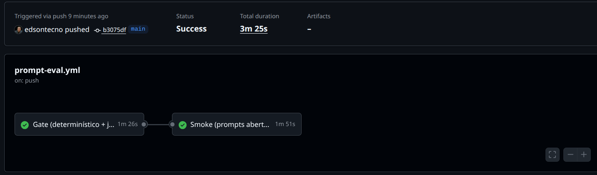
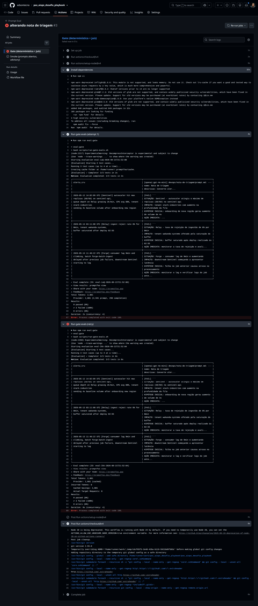

# Evidências CI — CP10

Registro das execuções do pipeline GitHub Actions. Capturas de tela em [`executions/`](./executions/).

## Repositório

| Campo | Valor |
|-------|-------|
| URL do repositório público | https://github.com/edsontecno/pos_aiops_desafio_playbook |
| Branch monitorada | `main` |
| Workflow | `.github/workflows/prompt-eval.yml` |
| Data da configuração de secrets | 21/09/2026 |

---

## Execução bem-sucedida

| Campo | Valor |
|-------|-------|
| Data/hora (UTC) | 2026-09-21 ~21:48 UTC |
| Trigger | push (`main`) |
| Commit | `b3075df` — *ajuste testes skomke* |
| Link da run GitHub Actions | https://github.com/edsontecno/pos_aiops_desafio_playbook/actions/runs/35658204473 |
| Duração total | 3m 25s |
| Job `prompt-eval-gate` | pass (1m 26s) |
| Job `prompt-eval-smoke` | pass (1m 51s) |
| Retry do gate necessário? | não |
| Observações | Primeira execução após ajuste dos smoke evals; ambos os jobs passaram sem retry |

### Resumo dos jobs

```
Job gate:   [x] pass  [ ] fail
Job smoke:  [x] pass  [ ] fail  [ ] advisory (não bloqueou merge)
```

### Capturas

| Visão | Arquivo |
|-------|---------|
| Resumo da run (jobs gate + smoke) | [`executions/execution.png`](./executions/execution.png) |
| Logs do job Gate | [`executions/ajuste-testes-skomke-·-edsontecno-pos_aiops_desafio_playbook-b3075df-09-21-2026_06_48_PM.png`](./executions/ajuste-testes-skomke-·-edsontecno-pos_aiops_desafio_playbook-b3075df-09-21-2026_06_48_PM.png) |
| Logs do job Smoke | [`executions/ajuste-testes-skomke-·-edsontecno-pos_aiops_desafio_playbook-b3075df-09-21-2026_06_49_PM.png`](./executions/ajuste-testes-skomke-·-edsontecno-pos_aiops_desafio_playbook-b3075df-09-21-2026_06_49_PM.png) |



### Resultados por prompt (run `35658204473`)

**Gate (determinístico + juiz)**

| Prompt | Testes | Resultado | Tokens |
|--------|--------|-----------|--------|
| nota-de-triagem | 3 | 3/3 pass (100%) | 2 691 |
| triagem-de-pods | 3 | 3/3 pass (100%) | 3 854 |
| networkpolicy-sentinel | 1 | 1/1 pass (100%) | 3 657 |
| causa-raiz-cerebro (juiz) | 1 | 1/1 pass (100%) | 13 917 |

**Smoke (prompts abertos, advisory)**

| Prompt | Testes | Resultado | Tokens |
|--------|--------|-----------|--------|
| backpressure-relay | 1 | 1/1 pass (100%) | 5 812 |
| migracao-forge-diagnostico | 1 | 1/1 pass (100%) | 1 897 |
| migracao-forge-plano | 1 | 1/1 pass (100%) | 1 835 |
| migracao-forge-fase-1 | 1 | 1/1 pass (100%) | 1 935 |
| networkpolicy-sentinel-verificacao | 1 | 1/1 pass (100%) | 1 772 |

### Run anterior (referência)

| Campo | Valor |
|-------|-------|
| Commit | *chore(openspec): arquiva change CP09 e sincroniza spec* |
| Link | https://github.com/edsontecno/pos_aiops_desafio_playbook/actions/runs/35657247446 |
| Duração | 5m 26s |
| Resultado | pass (gate + smoke) |

---

## Execução com falha provocada

| Campo | Valor |
|-------|-------|
| Data/hora (UTC) | 2026-09-21 ~21:52 UTC |
| Trigger | push (`main`) |
| Commit | `8dbd782` — *alterando nota de triagem* |
| Regressão introduzida | `registry/devops/nota-de-triagem/prompt.md` — rótulo `ALERTA:` renomeado para `SITUAÇÃO:`, quebrando o assert determinístico que exige os cinco rótulos padronizados |
| Link da run GitHub Actions | https://github.com/edsontecno/pos_aiops_desafio_playbook/actions/runs/35659533091 |
| Duração total | 56s |
| Job que falhou (esperado: gate) | `prompt-eval-gate` — falhou na tentativa 1 e no retry (exit code 100) |
| Smoke falhou também? | não — job `prompt-eval-smoke` **skipped** (gate falhou antes; `needs: prompt-eval-gate`) |
| PR bloqueado para merge? | n/a (trigger foi push direto em `main`; em PR o gate bloquearia o merge) |
| Revertido após evidência? | sim — `ALERTA:` restaurado localmente após captura |

### Captura

| Visão | Arquivo |
|-------|---------|
| Logs do job Gate (falha + retry) | [`executions/alterando-nota-de-triagem-·-edsontecno-pos_aiops_desafio_playbook-8dbd782-09-21-2026_06_52_PM.png`](./executions/alterando-nota-de-triagem-·-edsontecno-pos_aiops_desafio_playbook-8dbd782-09-21-2026_06_52_PM.png) |



### Resultado da regressão (run `35659533091`)

**Gate — `nota-de-triagem` (único config executado antes da falha)**

| Tentativa | Testes | Resultado | Tokens |
|-----------|--------|-----------|--------|
| 1 | 3 | 0/3 pass — **3 failed (100%)** | 2 691 |
| retry | 3 | 0/3 pass — **3 failed (100%)** | 2 691 |

Demais configs do gate (`triagem-de-pods`, `networkpolicy-sentinel`, `causa-raiz-cerebro`) não chegaram a rodar — o script abortou na primeira falha.

### Diff da regressão

```diff
- ALERTA: [sistema + condição que disparou — resumo do que aconteceu]
+ SITUAÇÃO: [sistema + condição que disparou — resumo do que aconteceu]
```

Arquivo: `registry/devops/nota-de-triagem/prompt.md` (commit `8dbd782`).

---

## Checklist do operador

- [x] Secrets `OPENAI_API_KEY` e `ANTHROPIC_API_KEY` configurados no GitHub (Settings → Secrets)
- [x] Workflow disparado em push para `main`
- [x] Evidência de sucesso registrada acima
- [x] Falha provocada testada e registrada acima
- [x] Regressão de teste revertida após evidência
